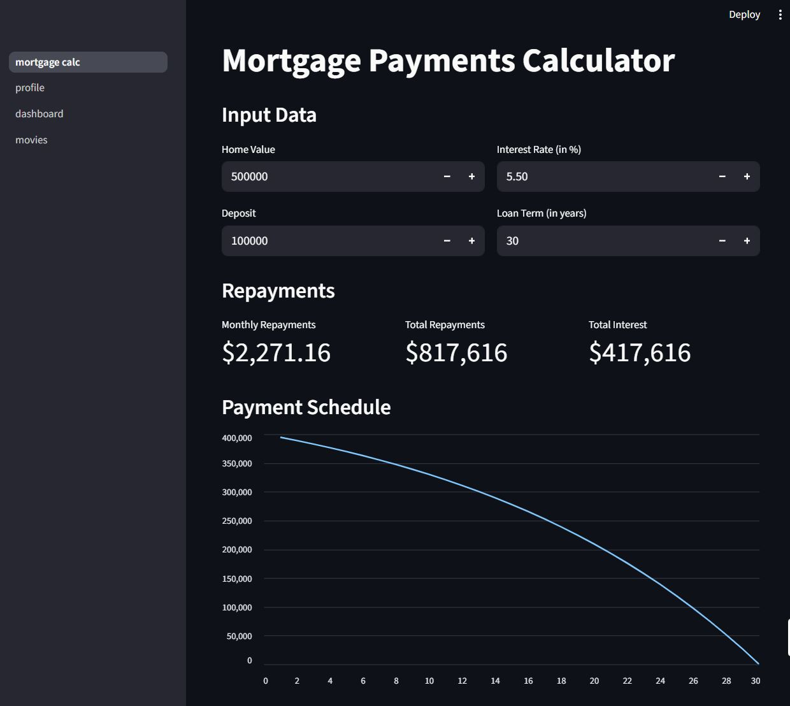
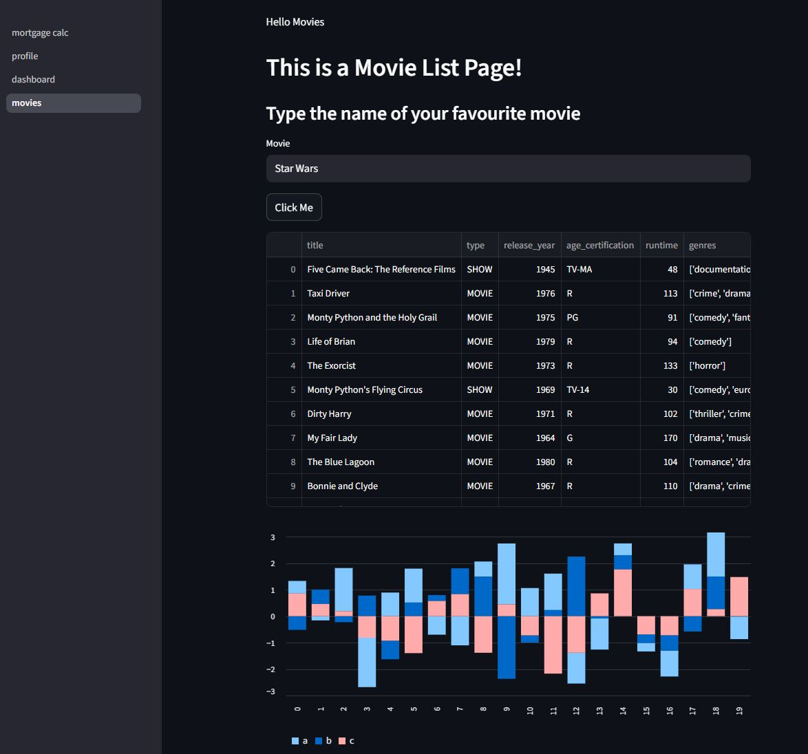

# Stream Lit App

---

## How to run on a Docker instance

01. Make sure Docker is installed and running  
02. Create a folder and navigate to it  
03. Clone this repository in that folder `GIT CLONE [REPO URL]`  
04. Run the following command to build the Docker Image on your local machine.  
    `docker build -t smkamran/streamlit-demo-app .`  
05. Run the below command to run the app  
    `docker run --rm -p 8501:8501 -v "$PWD/data:/app/data" smkamran/streamlit-demo-app`  
06. Navigate to `http://127.0.0.1:8501` in your browser  